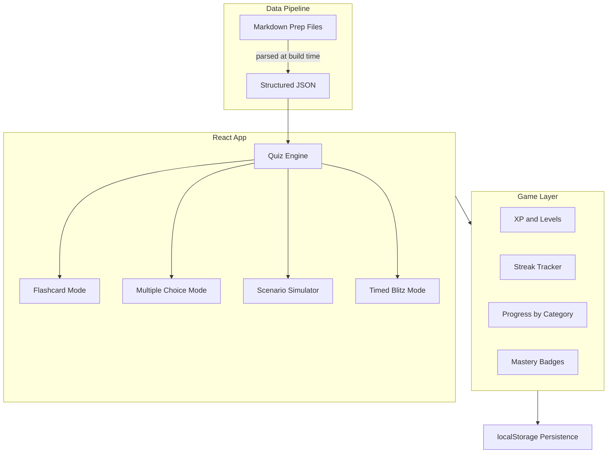
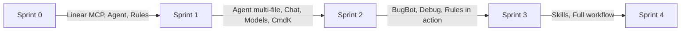

# Gamified ADM Study Tool — Build Plan

## Context

Interview is this week. We have ~~5 rich prep documents (~~3,500 lines of content) already written. The existing site ([index.html](index.html)) is a static hub linking to read-only HTML pages. We need to transform this content into an **active-recall study tool** — fast.

**Existing content to gamify:**

- [Tactical-Question-Bank.md](adm-prep/Tactical-Question-Bank.md) (832 lines) — CTO/CISO/Staff Engineer scenario conversations
- [Technical-Concepts-Deep-Dive.md](adm-prep/Technical-Concepts-Deep-Dive.md) (500 lines) — SDLC, architecture, CI/CD, security, metrics
- [Technical-Screen-Question-Bank.md](adm-prep/Technical-Screen-Question-Bank.md) — 27 probable interview Q&As
- [AI-Deployment-Manager-Prep-Guide.md](adm-prep/AI-Deployment-Manager-Prep-Guide.md) (844 lines) — Full study guide
- [Cursor-Product-Guide.md](cursor-product/Cursor-Product-Guide.md) (694 lines) — Cursor product knowledge

**Tech stack:** Vite + React (single-page app). Why: Cursor's agent mode is exceptionally good at generating React components; the component structure maps naturally to game features; and it mirrors a real developer workflow you can reference in interviews.

---

## Architecture Overview




---

## Sprint 0: Foundation (Linear + Scaffold)

**Time:** ~30 minutes | **Study value:** None yet | **Cursor learning:** High

### What we do

1. **Authenticate Linear MCP** and create a project with epics + issues for each sprint
2. **Scaffold** a Vite + React app inside the repo at `study-game/`
3. **Create Cursor Rules** for the new project (React patterns, component conventions)

### What you learn about Cursor


| Cursor Feature | How We Use It                                                                                   |
| -------------- | ----------------------------------------------------------------------------------------------- |
| **Linear MCP** | Create and manage issues directly from the IDE — no context switching                           |
| **Agent Mode** | Scaffold the entire Vite + React project in one prompt                                          |
| **Rules**      | Create `.cursor/rules/` files that guide all future AI-generated code to follow our conventions |


### What you learn about Linear

- Creating a project with status workflows (Backlog / In Progress / Done)
- Writing good issue descriptions that double as specs
- Using labels and priority to organize a sprint

---

## Sprint 1: Core Quiz Engine + Content Pipeline

**Time:** ~1.5 hours | **Study value:** HIGH — flashcards for all content | **Cursor learning:** High

### What we do

1. **Content parser** — Script that reads the 5 markdown files and extracts structured question/answer pairs into JSON
2. **Quiz engine** — Core logic: serve questions, track answers, calculate scores
3. **Flashcard mode** — Card flip UI showing Q on front, full answer on back, self-rate (Got It / Review Again)
4. **Category selection** — Pick which content area(s) to study

**Content categories (mapped from existing docs):**

- Technical Concepts (from Technical-Concepts-Deep-Dive.md)
- Technical Screen (from Technical-Screen-Question-Bank.md)
- Tactical Scenarios (from Tactical-Question-Bank.md)
- Deployment Strategy (from AI-Deployment-Manager-Prep-Guide.md)
- Cursor Product (from Cursor-Product-Guide.md)

### What you learn about Cursor


| Cursor Feature              | How We Use It                                                                            |
| --------------------------- | ---------------------------------------------------------------------------------------- |
| **Agent Mode (multi-file)** | Generate the parser, data models, quiz engine, and UI components in one coordinated pass |
| **Chat**                    | Ask Cursor to explain the code it generated — use this to understand React patterns      |
| **Model Selection**         | Try generating the quiz engine with different models; compare speed vs. quality          |
| **Cmd+K (inline edit)**     | Tweak individual components without regenerating everything                              |


---

## Sprint 2: Game Mechanics + Progress System

**Time:** ~1 hour | **Study value:** HIGH — motivation + targeted review | **Cursor learning:** Medium

### What we do

1. **XP system** — Earn points per correct/reviewed card; accumulate toward levels
2. **Progress dashboard** — Visual bars showing mastery % per category
3. **Streak tracker** — Daily study streak with localStorage persistence
4. **"Needs Review" queue** — Cards marked "Review Again" resurface with priority
5. **Session summary** — End-of-session scorecard: cards reviewed, accuracy, XP earned

### What you learn about Cursor


| Cursor Feature      | How We Use It                                                      |
| ------------------- | ------------------------------------------------------------------ |
| **BugBot**          | Enable BugBot on a PR to get AI code review on the game mechanics  |
| **Rules in action** | See how the rules from Sprint 0 keep the generated code consistent |
| **Debugging tools** | Use Cursor's debug mode if any game logic has issues               |


---

## Sprint 3: Scenario Simulator + Polish

**Time:** ~1 hour | **Study value:** VERY HIGH — practice actual conversations | **Cursor learning:** Medium

### What we do

1. **Scenario simulator** — Present a stakeholder question (from Tactical-Question-Bank.md), let the user type/think through their response, then reveal the expert approach. Self-rate quality.
2. **Timed blitz mode** — Speed round: 60 seconds, rapid-fire concept checks
3. **Responsive design** — Works on phone for studying away from desk
4. **Landing page update** — Add the game to [index.html](index.html)

### What you learn about Cursor


| Cursor Feature              | How We Use It                                                                               |
| --------------------------- | ------------------------------------------------------------------------------------------- |
| **Skills**                  | Create a custom Skill for consistent content formatting                                     |
| **Agent (complex prompts)** | Guide the agent to build the scenario simulator with specific UX requirements               |
| **Applying everything**     | Full workflow: write issue in Linear, implement with Agent, review with BugBot, close issue |


---

## Sprint 4 (Stretch): Advanced Features

**Time:** If time allows | **Study value:** Medium | **Cursor learning:** Bonus

- **Spaced repetition algorithm** — SM-2 or simplified version for optimal review timing
- **Mastery badges** — Unlock badges for completing categories or hitting streaks
- **Dark mode** — Toggle between light/dark themes
- **Export/share** — Export progress stats

---

## File Structure (Proposed)

```
study-game/
  package.json
  vite.config.js
  index.html
  public/
  src/
    main.jsx
    App.jsx
    data/
      questions.json          (generated from markdown parser)
      parser.js               (markdown-to-JSON conversion)
    components/
      Layout.jsx
      Dashboard.jsx
      QuizEngine.jsx
      FlashCard.jsx
      ScenarioSimulator.jsx
      TimedBlitz.jsx
      ProgressBar.jsx
      SessionSummary.jsx
      CategoryPicker.jsx
    hooks/
      useGameState.js         (XP, streak, progress)
      useQuiz.js              (question serving logic)
    styles/
      global.css
      components.css
.cursor/rules/
  adm-prep-guidance.mdc      (existing)
  study-game-conventions.mdc  (new — React/game patterns)
```

---

## How Each Sprint Maps to Cursor Learning




At each step, I will explain **what** we are doing, **why** we are doing it that way, and **which Cursor feature** makes it possible — so you build both the tool and the muscle memory simultaneously.

---

## How We Use Linear

1. **Sprint 0:** Create a "Study Game" project with 4 epics (one per sprint). Each epic has 3-5 issues with clear acceptance criteria.
2. **During build:** Move issues through Backlog -> In Progress -> Done as we complete them. I will prompt you to update status.
3. **After each sprint:** Quick retro — what worked, what to adjust.

This mirrors how real engineering teams use Linear and gives you a concrete story for interviews about managing technical projects.

---

## Immediate Next Steps

1. Authenticate the Linear MCP (I will trigger this)
2. You set up a Linear project (I will guide you)
3. We start Sprint 0 together

