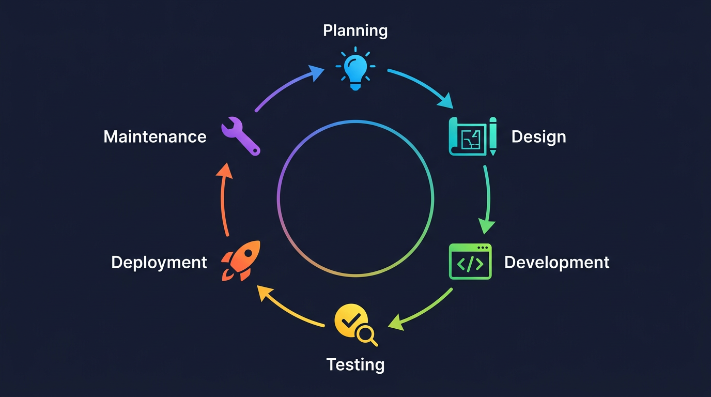
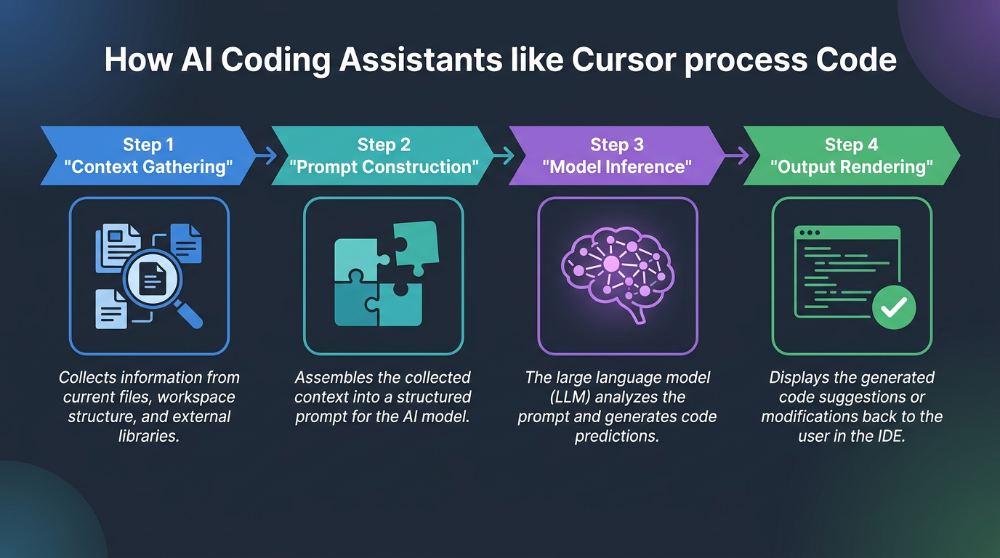
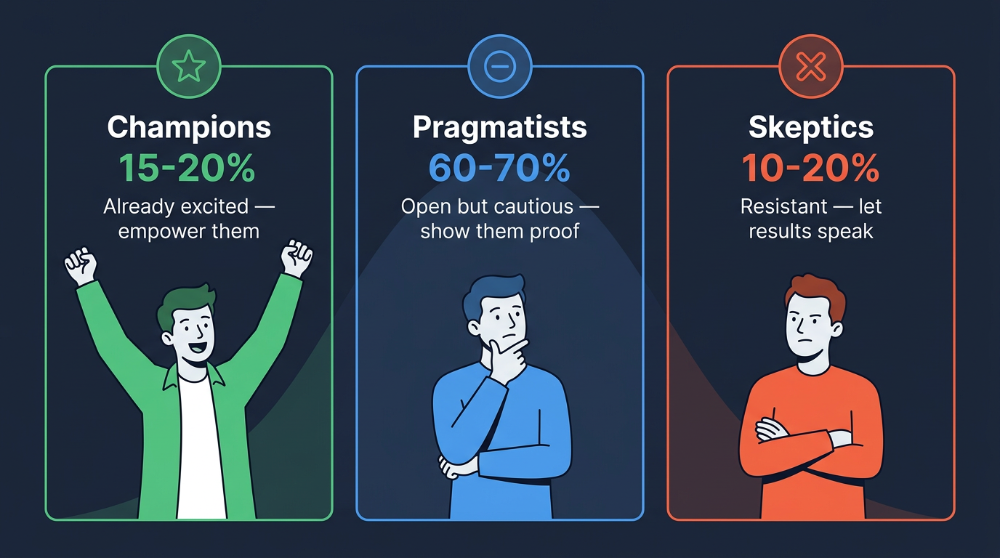
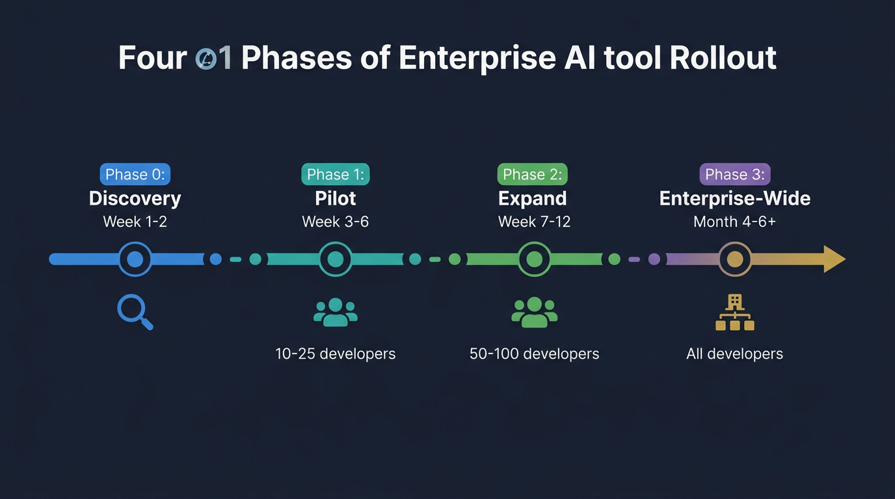
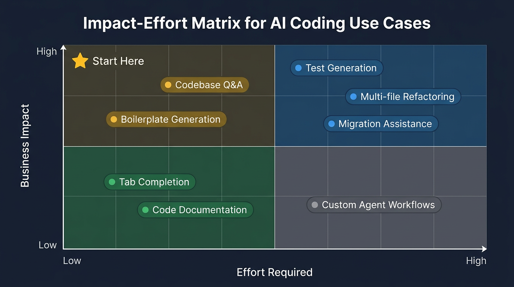
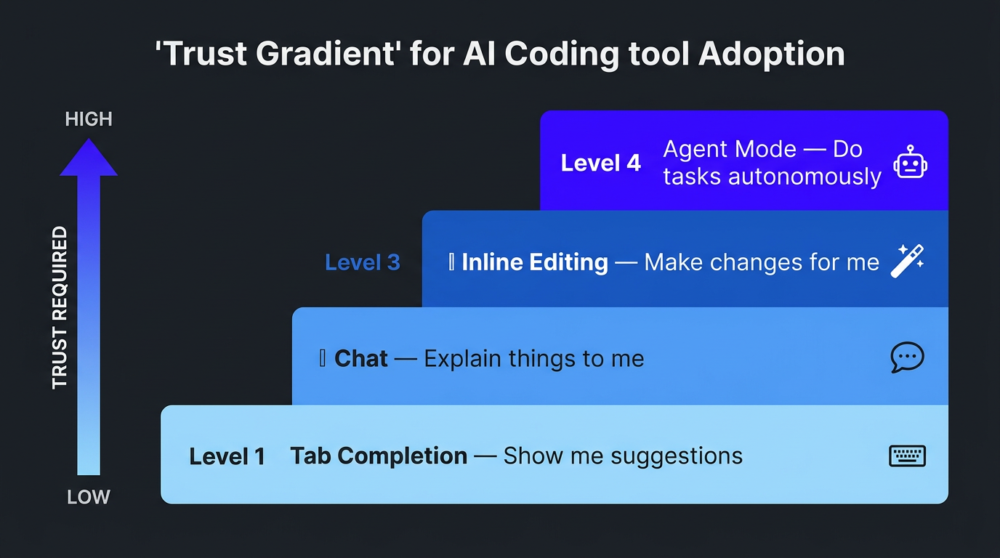

# The AI Deployment Manager's Study Guide

### A Sequential Learning Journey — From Technical Foundations to Enterprise Mastery

> **Author:** Richard Reyes
> **Target Role:** AI Deployment Manager at Cursor
> **Approach:** This guide is structured as a progressive learning path. Each chapter builds on the one before it, taking you from foundational concepts through product expertise to deployment strategy and interview readiness.

---

## Table of Contents

**Part I — Technical Foundations**
- [Chapter 1: How Software Gets Built](#chapter-1-how-software-gets-built)
- [Chapter 2: A Day in the Life of a Developer](#chapter-2-a-day-in-the-life-of-a-developer)
- [Chapter 3: The Building Blocks of Modern Software](#chapter-3-the-building-blocks-of-modern-software)

**Part II — AI-Powered Development**
- [Chapter 4: How AI Coding Tools Actually Work](#chapter-4-how-ai-coding-tools-actually-work)
- [Chapter 5: Cursor — The AI-Native Code Editor](#chapter-5-cursor--the-ai-native-code-editor)
- [Chapter 6: Where Cursor Shines and Where It Struggles](#chapter-6-where-cursor-shines-and-where-it-struggles)

**Part III — Understanding the Developer**
- [Chapter 7: Developer Pain Points](#chapter-7-developer-pain-points)
- [Chapter 8: The Three Adoption Personas](#chapter-8-the-three-adoption-personas)
- [Chapter 9: Becoming a Technical Thought Partner](#chapter-9-becoming-a-technical-thought-partner)

**Part IV — Enterprise Deployment Strategy**
- [Chapter 10: The Enterprise Rollout Playbook](#chapter-10-the-enterprise-rollout-playbook)
- [Chapter 11: Choosing High-Impact Use Cases](#chapter-11-choosing-high-impact-use-cases)
- [Chapter 12: Driving Adoption and Overcoming Resistance](#chapter-12-driving-adoption-and-overcoming-resistance)
- [Chapter 13: Measuring Success and Proving ROI](#chapter-13-measuring-success-and-proving-roi)

**Part V — Putting It Into Practice**
- [Chapter 14: Your Hands-On Learning Plan](#chapter-14-your-hands-on-learning-plan)
- [Chapter 15: Interview Preparation](#chapter-15-interview-preparation)
- [Chapter 16: Case Studies](#chapter-16-case-studies)

**Appendix**
- [Mental Models That Stick](#mental-models-that-stick)
- [Glossary of Essential Terms](#glossary-of-essential-terms)
- [The One-Page Cheat Sheet](#the-one-page-cheat-sheet)

---

# Part I — Technical Foundations

Before you can talk credibly about AI-powered development, you need to understand the world developers live in. This section gives you that foundation — no coding required.

---

## Chapter 1: How Software Gets Built

Every piece of software — from a banking app to a video game — follows a lifecycle. Think of it like building a house.

### The Six Phases

| Phase | House Analogy | Software Equivalent |
|-------|--------------|---------------------|
| **Planning** | "We need a 3-bedroom house with a pool" | Product requirements — what should the software do? |
| **Design** | Architect draws blueprints | System architecture — how will the pieces fit together? |
| **Development** | Construction crew builds | Developers write code |
| **Testing** | Building inspector checks work | QA and automated tests verify the code works |
| **Deployment** | Family moves in | Code goes live for users |
| **Maintenance** | Fixing the leaky faucet | Bug fixes, updates, new features |

### How Teams Actually Move Through These Phases

Most engineering teams today don't follow these steps in a straight line. They work in short cycles called **sprints** (usually 2 weeks), shipping small pieces continuously. This approach is called **Agile development**.

> **Why this matters for you:** Your job will involve fitting Cursor adoption into these existing rhythms — not disrupting them. If a team is mid-sprint on a critical feature, that's not the time to introduce a new tool. Understanding the cadence of how teams work is essential to deploying effectively.

---

## Chapter 2: A Day in the Life of a Developer

To deploy AI tools to developers, you need to understand what their day actually looks like.

### The Developer Workflow

A developer's typical day follows a predictable rhythm:

1. **Pull the latest code** — Download teammates' recent changes (using Git)
2. **Pick up a task** — From a project board (Jira, Linear, Asana)
3. **Write code** — In an IDE (Integrated Development Environment) like Cursor, VS Code, or IntelliJ
4. **Test locally** — Run the code on their own machine to check it works
5. **Submit a Pull Request (PR)** — Propose their changes for teammates to review
6. **Code Review** — Other developers read and critique the code
7. **Merge & Deploy** — Approved code gets combined into the main codebase and shipped

### Where Does AI Fit In?

Cursor primarily accelerates **steps 3, 4, and 5** — writing code, testing, and preparing changes for review. But its influence is expanding. The more of this workflow Cursor touches, the more valuable it becomes to the organization.

> **Key insight:** When you're in conversations with engineering leads, ask them to walk you through *their* version of this workflow. Every team has variations, and those details reveal where Cursor can have the greatest impact.

---

## Chapter 3: The Building Blocks of Modern Software

You don't need to master these concepts — you need to recognize them in conversation and understand why developers care about them.

### Git & Version Control

**What it is:** A system that tracks every change to code, like "Track Changes" in Google Docs but far more powerful.

**Why it matters:** It lets hundreds of developers work on the same project without overwriting each other.

**Key terms you'll hear:** repository (repo), branch, commit, merge, pull request.

### APIs (Application Programming Interfaces)

**The restaurant analogy:** You (the customer/app) don't go into the kitchen. You order from the menu (the API), and the kitchen (the server) sends back what you asked for.

**Why it matters:** Almost all modern software is built by connecting APIs together. When you use a ride-share app, it calls a Maps API, a Payment API, an SMS API, and more — all stitched together.

**For your role:** Understanding APIs helps you understand how Cursor integrates with other tools and why developers care about "API design."

### Databases

**The filing cabinet analogy:** A massive, organized filing cabinet that software reads from and writes to.

**Two main types:**
- **Relational (SQL):** Data in tables with rows and columns, like a spreadsheet (PostgreSQL, MySQL)
- **Non-relational (NoSQL):** More flexible storage, like a collection of documents (MongoDB, DynamoDB)

### System Architecture

**The city analogy:** A city's infrastructure — roads, power grid, water pipes — all connect different buildings.

| Layer | What It Is | Analogy |
|-------|-----------|---------|
| **Frontend** | What users see and interact with | The building's facade |
| **Backend** | The logic, data, and processing behind the scenes | Plumbing and electrical |
| **Infrastructure** | The servers, networks, and cloud services | The land and utilities |

**Common pattern today:** Microservices — instead of one giant application, companies build many small specialized services that communicate via APIs.

### The Cloud (AWS, GCP, Azure)

Instead of buying physical servers, companies rent computing power from Amazon (AWS), Google (GCP), or Microsoft (Azure). This is how virtually all modern software runs, and when developers say they're "deploying to the cloud," this is what they mean.

---

# Part II — AI-Powered Development

Now that you understand the developer's world, let's dive into the technology that's reshaping it.

---

## Chapter 4: How AI Coding Tools Actually Work

### Large Language Models (LLMs), Explained

LLMs are AI models trained on enormous amounts of text — including millions of lines of code — that can predict and generate text.

**Think of it this way:** Imagine the world's most well-read assistant who has studied millions of codebases, documentation pages, and Q&A forums. They don't "understand" code the way a human does, but they're extraordinarily good at pattern matching and generating plausible next steps.

The key models powering today's AI coding tools include GPT-4 (OpenAI), Claude (Anthropic), and Gemini (Google). Cursor uses multiple models and routes to the best one for each task.

### The Four-Step Pipeline

When a developer uses an AI coding tool, here's what happens under the hood:

1. **Context Gathering** — The tool reads your open files, project structure, recent edits, and cursor position
2. **Prompt Construction** — It silently builds a detailed prompt that includes all this context plus your request
3. **Model Inference** — It sends this prompt to an LLM, which generates a response
4. **Output Rendering** — The tool formats the response as code suggestions, inline edits, or conversational answers

### Key AI Concepts You Should Know

| Concept | Plain English | Why It Matters |
|---------|--------------|----------------|
| **Prompt** | The instruction/question you give to the AI | Better prompts = better code output |
| **Context window** | How much text the AI can "see" at once (like short-term memory) | Cursor's advantage is feeding the *right* context to the model |
| **Tokens** | The units LLMs process (roughly 1 token ~ 0.75 words) | Larger context windows cost more but produce better results |
| **Hallucination** | When the AI confidently generates something incorrect | A real risk — users must always verify AI output |
| **Fine-tuning** | Training a model further on specific data | Some enterprises want models tuned to their codebase |
| **RAG** | Retrieval-Augmented Generation — fetching relevant documents before generating | How Cursor pulls in the right files from your project |
| **Latency** | How long it takes to get a response | Developers are impatient — speed matters enormously |
| **Agentic workflows** | AI that can take multi-step actions autonomously | Cursor's Agent mode — this is the frontier of AI coding |

> **The bottom line:** You don't need to explain transformer architecture in an interview. But you *do* need to explain why context windows matter, what hallucinations are, and how Cursor uses RAG to stay grounded in a developer's actual codebase.

---

## Chapter 5: Cursor — The AI-Native Code Editor

### What Makes Cursor Different

Cursor is a **fork** (modified version) of VS Code, the most popular code editor in the world. Instead of bolting AI on as a plugin, Cursor rebuilt the editor with AI woven into every interaction.

**The car analogy:** It's the difference between a car with a phone mount (VS Code + Copilot) versus a car with a built-in infotainment system designed from scratch (Cursor). The integrated experience is fundamentally smoother.

### The Five Features You Need to Know Cold

#### 1. Tab Autocomplete
As you type, Cursor predicts what you're about to write — not just the next word, but entire blocks of code. It understands the context of your *whole project*, not just the current file. Developers report **30–50% fewer keystrokes**, which translates to reduced cognitive load, not just speed.

#### 2. Cmd+K (Inline Editing)
Highlight code, press Cmd+K, describe what you want changed in plain English, and Cursor rewrites it. Example: select a function, type "add error handling and retry logic," and watch the function transform. This is often where the "aha moment" happens.

#### 3. Chat (Cmd+L)
A conversational AI assistant that can see your entire codebase. Unlike ChatGPT, Cursor's chat knows *your* project — it can reference specific files, functions, and patterns. Use cases range from "explain this function" to "write tests for this component."

#### 4. Agent Mode (Cmd+I)
An autonomous AI that can execute multi-step tasks: editing multiple files, running terminal commands, fixing errors, and iterating. If Chat is like texting a contractor with questions, Agent mode is like hiring a contractor who shows up, does the work, and checks it themselves. This is where the biggest enterprise productivity gains come from.

#### 5. Context Awareness (@-mentions and Codebase Indexing)
Cursor indexes your entire codebase and lets you pull specific context into any conversation using @ references (`@file`, `@folder`, `@codebase`, `@web`, `@docs`). The #1 problem with AI coding tools is giving the AI enough context to be useful — Cursor solves this better than anyone.

### Enterprise-Critical Features

| Feature | What It Does | Why Enterprises Care |
|---------|-------------|---------------------|
| **Rules & Configuration** | `.cursor/rules/` files give AI persistent instructions (coding standards, patterns, preferred libraries) | Scales AI-assisted development across 500+ developers with consistency |
| **Privacy Mode** | Code is never stored on Cursor's servers, never used for training | The #1 concern of every enterprise CTO |
| **SOC 2 Compliance** | Enterprise security certification | Clears the security review hurdle |
| **Self-Hosted Options** | For the most security-conscious organizations | Opens the door for regulated industries |

---

## Chapter 6: Where Cursor Shines and Where It Struggles

Being credible means being honest about limitations. This is one of the strongest signals of trustworthiness in technical conversations.

### Where Cursor Excels

| Use Case | Who Benefits | Impact Level |
|----------|-------------|-------------|
| Writing boilerplate code | All developers | High — eliminates tedious repetitive work |
| Understanding unfamiliar codebases | New hires, team-switchers | Very High — onboarding time drops dramatically |
| Writing tests | All developers (most dislike writing tests) | Very High — test coverage increases with less effort |
| Code refactoring | Senior developers, tech leads | High — large-scale improvements become feasible |
| Documentation | All developers | Medium — AI generates docs from code |
| Debugging | All developers | High — AI can analyze errors and suggest fixes |
| Prototyping | Product teams, hackathons | Very High — ideas become working code in hours |
| Learning new frameworks | Junior developers | High — AI teaches through example in context |

### Where Cursor Struggles

1. **Hallucinations** — Cursor can generate plausible-looking code that's subtly wrong. Developers must always review AI output.
2. **Large-scale architecture** — AI is great at function-level work but less reliable for designing entire systems.
3. **Highly proprietary systems** — If a company uses deeply custom internal frameworks, the AI has less training data to draw from.
4. **Security-sensitive code** — Cryptography, auth systems, and financial logic require human expertise; AI mistakes here are dangerous.
5. **Non-determinism** — The same prompt can give different results each time, which can frustrate developers who expect predictable tools.
6. **Context limits** — Even with large context windows, truly massive codebases can exceed what the AI can process at once.
7. **Behavior change** — Some experienced developers resist AI tools, viewing them as crutches. Adoption is cultural, not just technical.

> **How to use this:** When a CTO asks about limitations, don't dodge. Lead with honesty: *"Cursor is a power tool, not autopilot — it amplifies developer expertise, it doesn't replace their judgment."* That sentence alone builds more trust than any feature demo.

---

# Part III — Understanding the Developer

The best deployment managers aren't the most technical people in the room — they're the ones who understand developers as *people*. This section is about building that empathy.

---

## Chapter 7: Developer Pain Points

These are the top frustrations developers face daily. Know them cold — they're the entry point to every enterprise conversation.

| Pain Point | What It Feels Like | How Cursor Helps |
|------------|-------------------|-----------------|
| **Context switching** | Being pulled between meetings, Slack, code review, and actual coding | Cursor keeps developers in flow by bringing answers to them |
| **Boilerplate/repetitive code** | Writing the same patterns over and over (CRUD operations, API endpoints, tests) | Tab completion and Agent mode eliminate repetitive work |
| **Understanding unfamiliar code** | "What does this function do?" "Why was it written this way?" | Chat with @codebase lets devs ask questions about any part of the project |
| **Debugging** | Spending hours tracking down a bug that turns out to be a typo | AI can analyze errors and suggest fixes in seconds |
| **Documentation** | Code is rarely well-documented, and writing docs feels like a chore | AI generates documentation from code automatically |
| **Slow feedback loops** | Waiting for tests to run, builds to complete, PRs to be reviewed | Cursor accelerates the write-test-review cycle |
| **Technical debt** | Knowing the code should be improved but never having time | Agent mode makes large-scale refactoring feasible |
| **Tooling friction** | Tools that are slow, break often, or don't integrate well | Cursor is built from the ground up to be fast and integrated |

> **For your role:** Every conversation with an engineering team should probe for these pain points. The ones they emphasize most tell you where Cursor will have the biggest impact — and where to start the pilot.

---

## Chapter 8: The Three Adoption Personas

Every engineering organization contains three types of people when it comes to new tool adoption. Your strategy for each one is different.

### Champions (15–20%)
Already excited about AI tools. They'll adopt immediately and start evangelizing.

**Your job:** Empower them. Give them early access, advanced tips, and a platform to share their wins. They'll do more for adoption than any top-down mandate.

### Pragmatists (60–70%)
Open but cautious. They've seen tools come and go. They need proof before they invest their time.

**Your job:** Give them structured onboarding, quick wins, and real data from the pilot. Don't oversell — show them peer results.

### Skeptics (10–20%)
Resistant. They may think AI writes bad code, threatens their jobs, or is overhyped.

**Your job:** Don't fight them. Let the Champions' results speak. Often, the strongest skeptics become the strongest advocates once they see genuine value — on their own terms.

### The Adoption Formula

> **Adoption = (Value Perceived x Ease of Use) / (Switching Cost + Fear of Change)**

Your entire deployment strategy comes down to maximizing the numerator and minimizing the denominator.

---

## Chapter 9: Becoming a Technical Thought Partner

### The Mindset Shift

You don't need to write code. You need to **understand the problems developers face** and **connect those problems to solutions**. Think of yourself as a translator between three worlds:

- **Business goals** ↔ Technical implementation
- **Product capabilities** ↔ Developer workflows
- **Adoption strategy** ↔ Engineering culture

### The DEEP Questions Framework

Use this structure in every discovery conversation:

| Letter | Step | Example |
|--------|------|---------|
| **D** | Diagnose the current state | "Walk me through how your team handles X today" |
| **E** | Explore the pain | "What's the most frustrating part of that workflow?" |
| **E** | Evaluate the impact | "If we solved that, what would change for your team?" |
| **P** | Propose a path | "What if we tried X approach — what concerns would you have?" |

### Good vs. Bad Questions

**Understanding their stack:**

| Bad Question | Good Question |
|-------------|--------------|
| "What programming languages do you use?" (Too surface-level) | "Can you walk me through your team's typical development workflow, from picking up a ticket to deploying?" (Shows you care about process) |
| "Do you use microservices?" (Yes/no kills the conversation) | "How is your codebase structured? Is it one large application or split into services?" (Open-ended, invites explanation) |
| "Are you using AI tools?" (Too obvious) | "How are your developers currently using AI in their workflow, if at all? What's working and what isn't?" (Invites honest assessment) |

**Diagnosing pain points:**

| Bad Question | Good Question |
|-------------|--------------|
| "What are your pain points?" (Too vague) | "When a new developer joins your team, how long before they're making meaningful contributions? What slows that down?" (Specific, measurable) |
| "Would Cursor help your team?" (Leading) | "Where do your developers spend the most time that *isn't* writing new features?" (Identifies waste without pushing a solution) |

### Translating Business Goals to Technical Outcomes

When a business leader says one thing, here's what it means technically — and how you connect the dots:

| What the CTO Says | What It Actually Means | How Cursor Helps |
|-------------------|----------------------|-----------------|
| "We need to increase velocity" | Reduce cycle time, remove bottlenecks | Agent mode for boilerplate, faster PR turnaround |
| "We need to do more with the same headcount" | Make each developer more productive | 1–2 hours saved per developer per day |
| "We're shipping too many bugs" | More test coverage, better code review | AI-generated tests, automated suggestions, team-wide rules |
| "Our attrition is too high" | Developers want modern tools, less tedious work | 87% of developers say AI tools improve their satisfaction |
| "New hires take 6 months to ramp" | Codebase complexity is a barrier | Cursor lets new devs ask questions conversationally |

---

# Part IV — Enterprise Deployment Strategy

This is the operational heart of your role. Everything in Parts I–III prepares you for this.

---

## Chapter 10: The Enterprise Rollout Playbook

Enterprise AI tool adoption follows a proven four-phase pattern. Trying to skip phases is how deployments fail.

### Phase 0: Discovery & Assessment (Week 1–2)

**Goal:** Understand the organization before proposing anything.

**Actions:**
- Meet with engineering leadership (CTO, VPs of Engineering, Directors)
- Interview 5–10 developers across different teams and seniority levels
- Map the technology stack (languages, frameworks, tools, cloud provider)
- Understand existing AI tool usage (GitHub Copilot? ChatGPT? Nothing?)
- Identify security and compliance requirements
- Map the decision-making process (who approves tools? procurement timeline?)

**Key discovery questions:**
- "What does your development workflow look like end-to-end?"
- "Where do developers spend time that isn't writing new features?"
- "What's your current stance on AI coding tools?"
- "What are your security requirements for developer tools?"
- "How do you typically roll out new tools to engineering?"

**Deliverable:** A brief assessment document summarizing findings and recommending a rollout approach.

### Phase 1: Pilot Program (Week 3–6)

**Goal:** Prove value with a small, motivated group.

**Team selection criteria:**
- 10–25 developers (large enough to be meaningful, small enough to support closely)
- A mix of senior and junior developers
- A team working on a project with clear, measurable output
- Ideally, a team with a "Champion" — someone already excited about AI tools
- Avoid teams in the middle of a critical launch

**Setup checklist:**
- Configure Cursor Business workspace for the pilot team
- Set up team-wide Cursor Rules (coding standards, architecture patterns)
- Create a shared Slack/Teams channel for the pilot group
- Run a 90-minute kickoff workshop (demo + hands-on)
- Establish baseline metrics (PRs/week, cycle time, developer survey scores)

**Support model:**
- Weekly 30-minute office hours
- Daily async support in the pilot channel
- 1:1 check-ins with 3–5 developers each week
- Share a "Tip of the Day" — one specific workflow that saves time

**What to watch for:**
- Which features get used most (Tab, Chat, Agent)?
- What complaints arise? (Speed? Accuracy? Privacy concerns?)
- Who becomes a power user? (These are your future internal champions)
- What use cases emerge that you didn't anticipate?

### Phase 2: Expand & Optimize (Week 7–12)

**Goal:** Scale from pilot to broader adoption with a proven playbook.

**Key actions:**
- Compile pilot results into an internal case study (with real numbers)
- Have pilot Champions present their experience to other teams
- Expand to 3–5 additional teams (50–100 developers)
- Refine Cursor Rules based on pilot learnings
- Create team-specific onboarding materials
- Build an internal "Cursor Best Practices" guide

**Scaling the support model:**
- Train pilot Champions to be peer mentors
- Shift from high-touch (1:1s) to scalable (workshops, documentation, recorded demos)
- Create a library of prompt templates for common tasks

### Phase 3: Enterprise-Wide Rollout (Month 4–6+)

**Goal:** Make Cursor the default development environment.

**Key actions:**
- Executive presentation: ROI data, developer satisfaction, velocity improvements
- Procurement: negotiate enterprise agreement
- IT integration: SSO, Privacy Mode configuration, usage policies
- Organization-wide launch: all-hands demo, team-by-team onboarding
- Ongoing enablement: monthly workshops, new feature rollouts, advanced training
- Quarterly business reviews: usage data, ROI tracking, feedback loops

---

## Chapter 11: Choosing High-Impact Use Cases

Not all use cases are created equal. Start where the effort is low and the impact is immediate, then build toward more ambitious applications.

### The Recommended Sequence

**Start here (low effort, meaningful impact):**
1. **Tab completion** — Zero behavior change required. Developers don't even have to do anything differently — suggestions just appear. This builds passive trust.
2. **Codebase Q&A** — Developers already ask questions about code. Now they ask Cursor instead of interrupting a colleague.
3. **Boilerplate generation** — Obvious time savings on repetitive patterns like CRUD operations, API endpoints, and configuration files.

**Then level up (high impact, higher effort):**
4. **Test generation** — Significant ROI, but requires workflow adjustment. Most developers know they should write more tests; AI makes it painless.
5. **Multi-file refactoring** — Powerful but needs trust in the AI. Agent mode shines here.
6. **Custom agent workflows** — Transformative for mature teams, but needs configuration and experimentation.

---

## Chapter 12: Driving Adoption and Overcoming Resistance

### Engineering the "Aha Moment"

Every developer needs to experience their personal "aha moment" with Cursor. Your job is to create the conditions for that moment to happen.

**Common aha moments:**
- *"I described a feature in English and Cursor built it across 4 files"*
- *"I asked Cursor to explain a function I'd been confused about for weeks, and it nailed it in 10 seconds"*
- *"Cursor wrote tests for my code that actually caught a bug I missed"*
- *"I onboarded to a new codebase in 2 days instead of 2 weeks"*

**How to engineer these moments:**
- In onboarding workshops, have developers bring a **real task** from their current sprint
- Don't use toy examples — use their actual codebase
- Start with their **biggest pain point**, not Cursor's coolest feature

### The Objection Playbook

| What They Say | What They Mean | Your Response |
|--------------|---------------|---------------|
| "AI writes bad code" | "I don't trust it" | "You're right that AI output needs review — just like any code. The best developers use Cursor as a first draft generator, not autopilot. You're still the expert." |
| "I'm faster without it" | "I don't want to change my workflow" | "Many of our most skeptical users found that Tab completion alone — zero workflow change — saved them 30+ minutes a day. Would you try just Tab for a week?" |
| "It's a security risk" | "I don't understand the privacy model" | "Great question. Let me walk you through Privacy Mode — your code never leaves your machine, is never stored on our servers, and is never used for training." |
| "It'll replace developers" | "I'm worried about my job" | "Every productivity tool in history has made developers *more* valuable, not less. Cursor handles the tedious parts so you can focus on problems that need human creativity." |

---

## Chapter 13: Measuring Success and Proving ROI

### Leading Indicators (Track Weekly)

These early signals tell you if people are actually using the tool:

| Metric | What It Tells You |
|--------|-------------------|
| **Activation rate** | % of licensed users who used Cursor in the last 7 days |
| **Feature adoption** | % who've used Chat, Agent, and Tab in the last 7 days |
| **Session frequency** | Average days per week each developer uses Cursor |
| **Acceptance rate** | % of AI suggestions that developers accept |

### Lagging Indicators (Track Monthly/Quarterly)

These business outcomes tell you if the tool is *working*:

| Metric | What It Tells You |
|--------|-------------------|
| **Developer velocity** | PRs merged per developer per week (before vs. after) |
| **Cycle time** | Average time from first commit to production deployment |
| **Developer satisfaction** | Quarterly survey scores |
| **Onboarding time** | Time for new hires to first meaningful PR |
| **Test coverage** | % of codebase covered by automated tests |
| **Retention** | Developer attrition rate vs. industry benchmarks |

### The Success Dashboard

| Metric | Baseline | Month 1 | Month 3 | Month 6 | Target |
|--------|----------|---------|---------|---------|--------|
| Weekly active users | 0 | 60% | 80% | 90%+ | 90%+ |
| Avg. daily time saved (self-reported) | 0 | 30 min | 60 min | 90 min | 60+ min |
| PRs merged/dev/week | X | — | +15% | +25% | +20% |
| Developer NPS for tools | X | — | — | +20 pts | +15 pts |
| New hire ramp time | X weeks | — | — | -30% | -25% |

### The ROI Math (Know This Cold)

This is the calculation you should be able to do on the fly in any conversation:

- **100 developers** x $180K average fully-loaded cost = **$18M/year** in engineering spend
- If Cursor saves each developer **1 hour/day** (12.5% productivity gain)
- That's equivalent to **$2.25M/year** in recovered productivity
- Cursor Business costs ~$40/user/month = **$48K/year** for 100 developers
- **ROI: ~47x return on investment**

> Scale this up or down based on the customer's team size. For a 500-person org, the numbers become staggering.

---

# Part V — Putting It Into Practice

Theory is important. Experience is what makes you credible.

---

## Chapter 14: Your Hands-On Learning Plan

### Philosophy

You don't need to become a developer. You need to **experience what developers experience** so you can speak from lived understanding, not slide decks.

### Week 1: Foundations & First Contact

**Days 1–2: Setup & Orientation**
- Install Cursor and explore the interface (sidebar, terminal, file explorer)
- Open the Command Palette (Cmd+Shift+P) and browse available commands
- Create a `learning-projects` folder and write your first Python file
- Open Cursor Chat (Cmd+L) and have a conversation about what an IDE is
- *Reflection: Write 3 sentences about what surprised you*

**Days 3–4: Tab Completion & Chat**
- Create a file and watch Tab completion suggest code from just a comment
- Build a simple calculator by writing a comment and letting Cursor generate the code
- Use Chat to explain the code, then ask it to add error handling
- *Key learning: Notice the difference between Tab (passive) and Chat (active)*

**Day 5: Cmd+K (Inline Editing)**
- Select code, press Cmd+K, and describe changes in plain English
- Build a simple to-do list program using *only* Cmd+K instructions
- *Key learning: Cmd+K is the "magic wand" — this is often where the aha moment happens*

**Days 6–7: Agent Mode**
- Use Agent mode to build a multi-file expense tracker from a single English description
- Watch it create files, write code, and iterate
- Ask Agent to add a new feature and observe how it modifies existing files
- *Key learning: Agent mode is the biggest differentiator and where the largest productivity gains live*

### Week 2: Deepening Understanding

**Days 8–9: Context & @-Mentions**
- Use `@codebase`, `@file`, and `@web` to pull specific context into conversations
- Create `.cursor/rules/` and see how rules shape AI output
- *Key learning: Context is everything. Rules are how teams enforce standards at scale.*

**Days 10–11: Simulating Enterprise Use Cases**
- Clone an open-source project and pretend you're a new developer onboarding
- Use Chat to get oriented, understand the codebase, and find key files
- Generate tests for existing code and try running them
- Generate documentation using Cmd+K

**Days 12–14: Building Intuition**
- Build one small project per day using Cursor Agent:
  - Day 12: A quiz game
  - Day 13: A simple web page
  - Day 14: A data analysis script
- After each, write down: What worked? Where did AI struggle? What prompts got the best results?

### Week 3: Interview Readiness

**Days 15–16: Prompt Engineering**
- Take the same task and try 5 different prompts, from vague to highly specific
- Document how output quality changes with prompt quality
- Practice the "give context, be specific, state constraints" framework

**Days 17–18: Simulating Conversations**
- Use Cursor Chat to role-play: ask it to pretend to be a skeptical senior engineer, then a CTO evaluating Cursor
- Practice your pitch and responses to objections

**Days 19–21: Capstone Projects**
- Build a demo web application using Cursor Agent, documenting your process
- Write a rollout proposal for a hypothetical 500-person engineering org
- Record a 5-minute screen recording of yourself using Cursor, narrating what you're doing

---

## Chapter 15: Interview Preparation

### Product Understanding Questions

**"How would you explain Cursor to a non-technical executive?"**

> "Cursor is an AI-powered development environment that makes software engineers significantly more productive. If traditional coding is like writing a document from scratch, Cursor is like having an expert collaborator who's read your entire codebase and can draft, edit, and review alongside you — but you're always in control. Enterprises typically see 20–30% productivity improvements per developer, which at scale translates to millions in value."

**"What makes Cursor different from GitHub Copilot?"**

> "The core difference is architectural. Copilot is a plugin bolted onto VS Code — it's great at line-by-line autocomplete, but limited by what a plugin can access. Cursor rebuilt the entire editor around AI. That means multi-file Agent workflows, deeply context-aware suggestions that understand your whole project, and team-level configuration through Rules. It's the difference between adding a turbo to an existing engine versus designing an engine from the ground up for performance."

**"Where does Cursor fail?"**

> "Being honest about limitations is essential for credibility. Cursor struggles with highly novel or proprietary systems, security-critical code where human expertise is non-negotiable, and very large-scale architectural decisions where the problem is too broad for the context window. The key message: Cursor is a power tool, not autopilot — it amplifies expertise, it doesn't replace judgment."

### Deployment & Strategy Questions

**"How would you roll out Cursor at a 1,000-person engineering org?"**

> Use the four-phase playbook: start with discovery, run a pilot of 20–30 developers, measure relentlessly, build internal champions, expand in waves. Always lead with the developers' pain points rather than pushing features.

**"A CTO says their developers tried Copilot and weren't impressed. How do you respond?"**

> "That's a great starting point — it means your team is open to AI and has high standards. The most common reason developers are underwhelmed by Copilot is that it's limited to autocomplete. I'd set up a 45-minute working session with 3–4 developers using their actual codebase. Agent mode and codebase Q&A tend to produce a very different reaction."

**"How do you measure success?"**

> Leading indicators (activation rate, feature adoption) tell you if people are using it. Lagging indicators (velocity, cycle time, satisfaction) tell you if it's working. The most important thing is establishing a baseline *before* the rollout.

### Cross-Functional Questions

**"How would you work with the Product team when enterprise customers request features?"**

> "I'd be the voice of the customer inside the product organization: maintaining a structured feedback log, categorizing requests by frequency and impact, and presenting synthesized insights — not just 'Customer X wants Y,' but 'These 8 customers share the same underlying problem, and here's a solution framework.'"

**"How would you handle Sales promising a feature that doesn't exist?"**

> "First, acknowledge the customer's need. Then get specific: 'What problem are you trying to solve?' Often the underlying need can be addressed with existing capabilities. If it truly requires new development, I'd give an honest timeline. Overpromising destroys trust."

### The Non-Technical Background Question

**"You don't have an engineering background. How would you be credible with CTOs?"**

> "I'm not an engineer and I won't pretend to be. But I've invested deeply in understanding how developers work, what pain points they face, and how AI tools fit into real workflows. I've spent weeks using Cursor daily, building projects, and studying deployment patterns. What I bring is the ability to translate between business objectives and technical outcomes, structure rollout programs that drive adoption, and speak to ROI in terms both CTOs and CFOs understand. The best deployment leaders aren't the most technical — they're the ones who listen deeply and connect the dots others miss."

### Handling Technical Questions You Don't Know

**Framework: The Honest Expert**

1. **Acknowledge honestly:** "That's a great question. Let me share what I know and flag where I'd confirm with the engineering team."
2. **Share what you DO know:** Demonstrate contextual understanding
3. **Bridge to value:** Connect back to what matters to them
4. **Commit to follow-up:** "I'll get you a definitive answer by tomorrow"

**Example:**

> CTO: "Does Cursor support our custom LSP extensions?"
>
> You: "Since Cursor is built on VS Code's architecture, it inherits VS Code's extension ecosystem including LSP support. For custom extensions, compatibility is generally high, but I'd want to validate your specific extensions in the pilot. Can you share which extensions are critical? I'll get our engineering team to confirm."

---

## Chapter 16: Case Studies

### Case Study 1: FinTech Company

**Scenario:** A 300-person fintech (150 engineers) uses Java and Python. Strict security requirements (SOC 2, US data residency). The CTO is interested; the CISO is skeptical. They currently use IntelliJ, not VS Code.

**Your approach should address:**
- Security concerns: Privacy Mode, SOC 2 compliance, data residency
- The IntelliJ switching cost: Cursor is VS Code-based — this is a real barrier for Java teams
- Pilot design: which team, which language, what metrics
- ROI quantification for their CFO

### Case Study 2: E-Commerce Platform

**Scenario:** 500 engineers across 40 teams. React frontend, Node.js backend, Python for data/ML. They already have GitHub Copilot but only 30% adoption. Leadership wants alternatives.

**Your approach should address:**
- Why Copilot adoption is low (discovery questions)
- Framing Cursor as an upgrade, not a replacement (migration strategy)
- Reaching the 70% who aren't using *any* AI tool
- Quick wins that go beyond autocomplete (Agent mode, codebase Q&A)

### Case Study 3: Healthcare SaaS

**Scenario:** 80 engineers. HIPAA compliance is mandatory. The VP of Engineering is a champion, but engineers are skeptical after a bad experience with an AI tool that introduced a security vulnerability.

**Your approach should address:**
- Directly addressing the past security incident
- HIPAA compliance specifics (Privacy Mode, data handling)
- Building trust with skeptical engineers (start small, prove it)
- Leveraging the VP as an internal champion

---

# Appendix

---

## Mental Models That Stick

### 1. The 10x Team Reality
Individual "10x developers" are rare. What actually exists: **10x teams** — teams with great tools, clear processes, and low friction. Cursor is a team multiplier, not an individual one.

### 2. Developer Experience (DX) = User Experience for Engineers
Developers are the "users" of internal tools. If a tool is slow, confusing, or unreliable, they'll abandon it — just like a consumer abandons a bad app.

### 3. The Toil Tax
Every organization has "toil" — repetitive, automatable work that eats developer time. AI tools attack toil. The more toil a team has, the more valuable Cursor becomes.

### 4. The Trust Gradient

Developers' trust in AI follows a gradient. Always start adoption at Level 1 and let developers move up naturally.

- **Level 1:** "Show me suggestions" (Tab) — lowest trust required
- **Level 2:** "Explain things to me" (Chat) — moderate trust
- **Level 3:** "Make changes for me" (Cmd+K) — higher trust
- **Level 4:** "Do tasks autonomously" (Agent) — highest trust

### 5. The Compound Effect of Small Savings
5 minutes saved x 20 times a day x 250 working days = **416 hours/year** per developer. That's 10+ weeks. Small improvements compound dramatically at scale.

### 6. Land and Expand
Enterprise adoption follows a pattern: land a small pilot, prove value, expand to more teams. Never try to boil the ocean on day one.

### 7. The Inside-Out Adoption Model
Sustainable tool adoption doesn't happen purely top-down (management mandate) or bottom-up (individual developers). It happens inside-out: start with a core group of enthusiasts, give them proof points, and let them pull others in.

---

## Glossary of Essential Terms

### Development & Workflow

| Term | Definition |
|------|-----------|
| **IDE** | Integrated Development Environment — the application developers write code in |
| **Git** | Version control system — tracks all changes to code, enables collaboration |
| **Repository (Repo)** | A project's complete codebase, stored in Git |
| **Branch** | A parallel copy of code where you make changes without affecting the main version |
| **Pull Request (PR)** | A proposal to merge changes into the main code, reviewed by teammates |
| **Commit** | A saved checkpoint of code changes with a description |
| **Deploy** | Push code from development to a live environment |
| **CI/CD** | Continuous Integration/Continuous Deployment — automated test and deploy systems |
| **Sprint** | A 1–4 week work cycle in Agile development (usually 2 weeks) |
| **Standup** | Daily 15-minute team meeting to share progress and blockers |
| **Retrospective** | Post-sprint meeting to discuss what went well and what to improve |
| **Technical Debt** | Shortcuts in code that save time now but create problems later |
| **Refactoring** | Improving code's structure without changing what it does |
| **Boilerplate** | Repetitive, standard code that follows a predictable pattern |

### Architecture & Infrastructure

| Term | Definition |
|------|-----------|
| **API** | Application Programming Interface — a structured way for systems to communicate |
| **REST API** | The most common API type, using HTTP requests (GET, POST, PUT, DELETE) |
| **Frontend** | The part of software users see and interact with |
| **Backend** | Server-side logic, databases, and systems behind the scenes |
| **Full-stack** | A developer who works on both frontend and backend |
| **Microservices** | Architecture where an app is split into small, independent services |
| **Monolith** | Architecture where the entire app is one single codebase |
| **Docker/Container** | A package that bundles code with its dependencies to run the same everywhere |
| **Kubernetes (K8s)** | A system for managing many containers at scale |
| **Cloud (AWS/GCP/Azure)** | Remote computing resources rented from major providers |
| **SDK** | Software Development Kit — tools/libraries for building on a platform |
| **Framework** | A pre-built structure for building applications (React, Django, Spring) |

### AI & Machine Learning

| Term | Definition |
|------|-----------|
| **LLM** | Large Language Model — AI trained on text data (GPT-4, Claude, etc.) |
| **Context Window** | How much text an LLM can process at once |
| **Token** | The unit LLMs process (~0.75 words per token) |
| **RAG** | Retrieval-Augmented Generation — fetching relevant info before generating |
| **Prompt Engineering** | The practice of crafting effective instructions for AI |
| **Hallucination** | When AI generates confident but incorrect information |
| **Fine-tuning** | Further training an AI model on specific data |
| **Inference** | The process of an AI generating output from input |
| **Latency** | Time delay between request and response |

### Business & Compliance

| Term | Definition |
|------|-----------|
| **SOC 2** | Security compliance standard for cloud services |
| **SSO** | Single Sign-On — one login for multiple systems |
| **HIPAA** | Healthcare data privacy regulation |
| **NPS** | Net Promoter Score — customer/user satisfaction metric |
| **ARR** | Annual Recurring Revenue — key metric for subscription businesses |
| **Churn** | Rate at which customers/users stop using a product |
| **TAM** | Total Addressable Market — the full revenue opportunity |

---

## The One-Page Cheat Sheet

### About the Product
Cursor isn't just autocomplete — it's an AI-native development environment that understands your entire codebase and can act autonomously. The key differentiator is depth of integration: context awareness, Agent mode, and team-level configuration that no plugin can match.

### About Developers
Developers are craftspeople who take pride in their work. They're skeptical of tools that overpromise and will adopt tools that genuinely save them time. Respect their expertise, lead with their pain points, and let results speak louder than marketing.

### About Enterprise Deployment
Adoption is not a technical problem — it's a change management problem. Start small with champions, prove value with data, and expand through peer influence. Security and privacy are table stakes, not differentiators.

### About Your Role
You are the bridge. Your job is not to be the smartest technical person in the room — it's to be the best listener, the clearest communicator, and the most structured thinker. You connect developer pain to product capabilities, capabilities to business outcomes, and outcomes to customer success.

### The One-Liner
> **"I help engineering teams get dramatically more productive with AI, by understanding their workflows deeply and guiding adoption strategically."**

---

### Daily Preparation Checklist

- [ ] Spend 30–60 minutes using Cursor (build something, explore a feature)
- [ ] Read one article about developer productivity or AI coding tools
- [ ] Practice explaining one technical concept in plain English
- [ ] Review one chapter of this guide
- [ ] Practice answering one interview question out loud

---

*Last updated: March 23, 2026*
*You've got this, Richard.*
